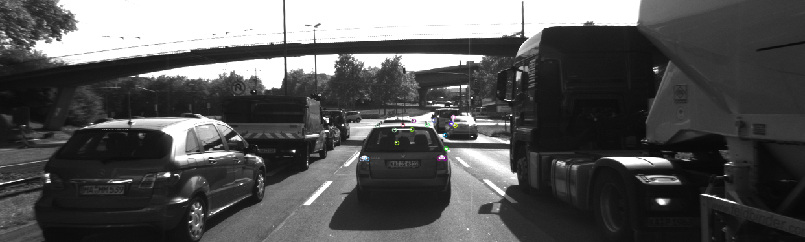
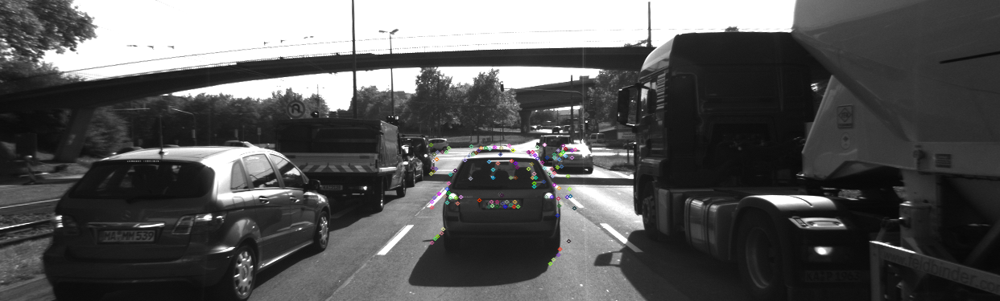
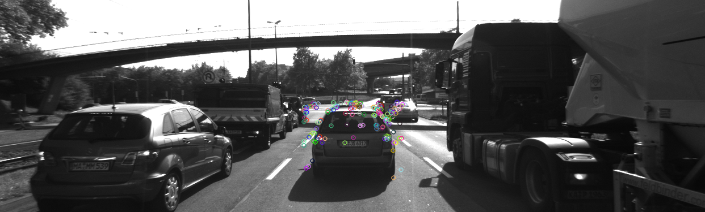
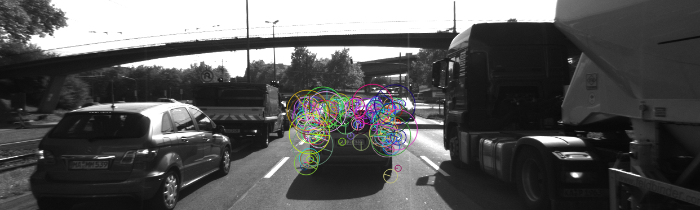
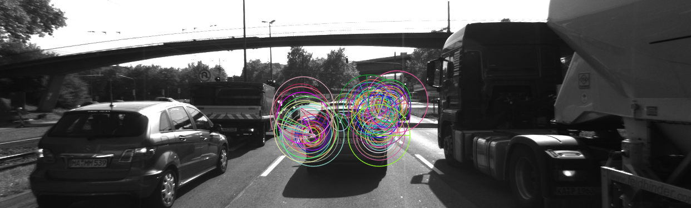
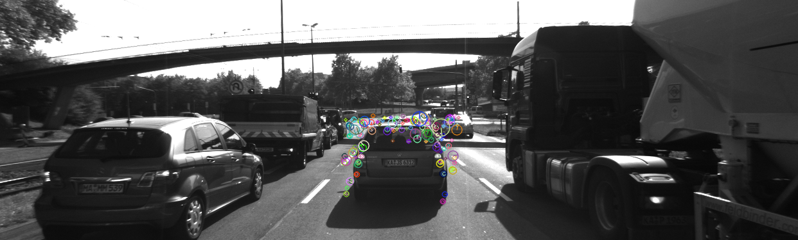
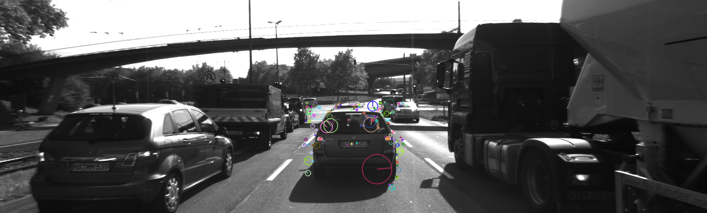

# SFND_2D_Feature_Matching

## MP.1 Data Buffer Optimization
Implement a vector for dataBuffer objects whose size does not exceed a limit (e.g. 2 elements). This can be achieved by pushing in new elements on one end and removing elements on the other end. 
```
if (dataBuffer.size()<dataBufferSize)
{
    dataBuffer.push_back(frame);
}else
{
    dataBuffer.push_back(frame);
    dataBuffer.erase(dataBuffer.begin());
}
```

## MP.2 Keypoint Detection
Implement detectors HARRIS, FAST, BRISK, ORB, AKAZE, and SIFT and make them selectable by setting a string accordingly.

### Harris Detector Implementation
```
int blockSize = 2;     // for every pixel, a blockSize × blockSize neighborhood is considered
int apertureSize = 3;  // aperture parameter for Sobel operator (must be odd)
int minResponse = 100; // minimum value for a corner in the 8bit scaled response matrix
double k = 0.04;

cv::Mat dst, dst_norm, dst_norm_scaled;
dst = cv::Mat::zeros(img.size(), CV_32FC1);
cv::cornerHarris(img, dst, blockSize, apertureSize, k, cv::BORDER_DEFAULT);
cv::normalize(dst, dst_norm, 0, 255, cv::NORM_MINMAX, CV_32FC1, cv::Mat());
cv::convertScaleAbs(dst_norm, dst_norm_scaled);

double maxOverlap = 0.0; 
for (size_t j = 0; j < dst_norm.rows; j++)
{
    for (size_t i = 0; i < dst_norm.cols; i++)
    {
        int response = (int)dst_norm.at<float>(j, i);
        if (response > minResponse)
        { 
            cv::KeyPoint newKeyPoint;
            newKeyPoint.pt = cv::Point2f(i, j);
            newKeyPoint.size = 2 * apertureSize;
            newKeyPoint.response = response;

            // perform non-maximum suppression (NMS) in local neighbourhood
            bool bOverlap = false;
            for (auto it = keypoints.begin(); it != keypoints.end(); ++it)
            {
                double kptOverlap = cv::KeyPoint::overlap(newKeyPoint, *it);
                if (kptOverlap > maxOverlap)
                {
                    bOverlap = true;
                    if (newKeyPoint.response > (*it).response)
                    {                     
                        *it = newKeyPoint; 
                        break;             
                    }
                }
            }
            if (!bOverlap)
            {                                    
                keypoints.push_back(newKeyPoint); 
            }
        }
    } 
}    
```
### FAST, BRISK, ORB, AKAZE, SIFT Detector Implementation
```
cv::Ptr<cv::FeatureDetector> detector;

if (detectorType.compare("FAST") == 0)
{

    int threshold = 30; // difference between intensity of the central pixel and pixels of a circle around this pixel
    bool bNMS = true;   // perform non-maxima suppression on keypoints

    detector = cv::FastFeatureDetector::create(threshold, bNMS, cv::FastFeatureDetector::TYPE_9_16);
}
else if (detectorType.compare("SIFT") == 0)
{
    detector = cv::xfeatures2d::SIFT::create();
}
else if (detectorType.compare("BRISK") == 0)
{
    detector = cv::BRISK::create();
}
else if (detectorType.compare("ORB") == 0)
{
    detector = cv::ORB::create();
}
else if (detectorType.compare("AKAZE") == 0)
{
    detector = cv::AKAZE::create();
}

detector->detect(img, keypoints);
```

## MP.3 Keypoint Removal
Remove all keypoints outside of a pre-defined rectangle and only use the keypoints within the rectangle for further processing. 

Used cv::Rect.contatin() to check if the point is inside the desired area. If not erased from the keypoints. 
```
cv::Rect vehicleRect(535, 180, 180, 150);
if (bFocusOnVehicle)
{
    for (auto it=keypoints.begin(); it!=keypoints.end();)
    {
        cv::Point P(it->pt.x, it->pt.y);
        
        if (!vehicleRect.contains(P))
        {
            it=keypoints.erase(it);
        }else
        {
            it++;
        }
        
    }
}
```

## MP.4 Keypoint Descriptors
Implement descriptors BRIEF, ORB, FREAK, AKAZE and SIFT and make them selectable by setting a string accordingly.
```
cv::Ptr<cv::DescriptorExtractor> extractor;
if (descriptorType.compare("BRISK") == 0)
{

    int threshold = 30;        // FAST/AGAST detection threshold score.
    int octaves = 3;           // detection octaves (use 0 to do single scale)
    float patternScale = 1.0f; // apply this scale to the pattern used for sampling the neighbourhood of a keypoint.

    extractor = cv::BRISK::create(threshold, octaves, patternScale);
    
}else if (descriptorType.compare("BRIEF") == 0)
{
    extractor = cv::xfeatures2d::BriefDescriptorExtractor::create();
}
else if (descriptorType.compare("ORB") == 0)
{
    extractor = cv::ORB::create();
}

else if (descriptorType.compare("FREAK") == 0)
{
    extractor = cv::xfeatures2d::FREAK::create();
}
else if (descriptorType.compare("AKAZE") == 0)
{

    extractor = cv::AKAZE::create();
}
else if (descriptorType.compare("SIFT") == 0)
{
    extractor = cv::xfeatures2d::SIFT::create();
}

extractor->compute(img, keypoints, descriptors);
```

## MP.5 Descriptor Matching
Implement FLANN matching as well as k-nearest neighbor selection. Both methods must be selectable using the respective strings in the main function. 
```
bool crossCheck = false;
cv::Ptr<cv::DescriptorMatcher> matcher;
    
if (matcherType.compare("MAT_BF") == 0)
{
    int normType = descriptorType.compare("DES_BINARY") == 0 ? cv::NORM_HAMMING : cv::NORM_L2;
    matcher = cv::BFMatcher::create(normType, crossCheck);
}else if (matcherType.compare("MAT_FLANN") == 0)
{

    if (descSource.type() != CV_32F)
    {
        descSource.convertTo(descSource, CV_32F);
        descRef.convertTo(descRef, CV_32F);
    }

    matcher = cv::DescriptorMatcher::create(cv::DescriptorMatcher::FLANNBASED);
}

// perform matching task
if (selectorType.compare("SEL_NN") == 0)
{ // nearest neighbor (best match)

    matcher->match(descSource, descRef, matches); 
} else if (selectorType.compare("SEL_KNN") == 0)
{ // k nearest neighbors (k=2)

    std::vector< std::vector<cv::DMatch>> knn_matches;
    matcher->knnMatch(descSource, descRef, knn_matches, 2);
}
```

## MP.6 Descriptor Distance Ratio
Use the K-Nearest-Neighbor matching to implement the descriptor distance ratio test, which looks at the ratio of best vs. second-best match to decide whether to keep an associated pair of keypoints.

```
double minDescDistRatio = 0.8;
for (auto it = knn_matches.begin(); it != knn_matches.end(); ++it)
{

    if ((*it)[0].distance < minDescDistRatio * (*it)[1].distance)
    {
	matches.push_back((*it)[0]);
    }
}
```

## MP.7 Performance Evaluation 1
 Count the number of keypoints on the preceding vehicle for all 10 images and take note of the distribution of their neighborhood size. Do this for all the detectors you have implemented. 

### Number of Keypoints

|Detector       | Keypoint #(10 frames - ROI)	 	 	 | Keypoint #(Average - ROI)|
| ------------- | ---------------------------------------------	 |:---------------------:   |
| Harris        | 17, 14, 18, 21, 26, 43, 18, 31, 26, 34 	 |25 		            |
| Shi-Tomasi	|125, 118, 123, 120, 120, 113, 114, 123, 111 ,112|118      		    |
| FAST	        |149, 152, 150, 155, 149, 149, 156, 150, 138, 143|149       		    |
| BRISK		|254, 274, 276, 275, 293, 275, 289, 268, 259, 250|271       		    |
| ORB		|91, 102, 106, 113, 109, 124, 129, 127, 124, 125 |115       		    |
| AKAZE		|162, 157, 159, 154, 162, 163, 173, 175, 175, 175|166       		    |
| SIFT    	|137, 131, 121, 135, 134, 139, 136, 147, 156, 135|137       		    |


### Neighbourhood Size

- HARRIS, SHITOMASI, FAST only has small neighbourhood size. (small distribution)**

    Harris, Shi-Tomasi takes inputs the constant block size

- AKAZE , BRISK, SIFT, ORB keypoints have differnet neighbourhood sizes.

    BRISK, ORB shows the largest distribution, followed by SIFT and AKAZE


1. HARRIS



2. SHITOMASI



3. FAST



4. BRISK



5. ORB



6. AKAZE



7. SIFT



## MP.8 Performance Evaluation 2
Count the number of matched keypoints for all 10 images using all possible combinations of detectors and descriptors. In the matching step, the BF approach is used with the descriptor distance ratio set to 0.8.

**SIFT and AKAZE descriptor not used with other algorithms**

- SIFT is likely to be incompatible with other algorithms

    SIFT detector is known to save information in octave field of keypoints. so other descriptor dealing with original octave values will cause error

    SIFT descriptor needs octave field filled but most algorithm isn't capable of this

- AKAZE descriptor only works with AKAZE detector

### Number of Matched Keypoints


|Detector/Descriptor       | Matched #(9 Matches - ROI)	 	 	 | Matched #(Average - ROI)|
| ------------- | ---------------------------------------------	 |:---------------------:   |
| **Harris**    |	 					 | 		            |
|  +BRISK       | 12, 10, 14, 15, 16, 16, 15, 23, 21		 |16 		            |
|  +BRIEF       | 14, 11, 15, 20, 24, 26, 16, 24, 23	 	 |19 		            |
|  +ORB         | 12, 13, 16, 18, 24, 18, 15, 24, 20 	         |18 		            |
|  +FREAK       | 13, 13, 15, 15, 17, 20, 12, 21, 18     	 |16 		            |
|**Shi-Tomasi**	|						 |      		    |
|  +BRISK       | 95, 88, 80, 90, 82, 79, 85, 86, 82	 	 |85 		            |
|  +BRIEF       | 115, 111, 104, 101, 102, 102, 100, 109, 100 	 |105 		            |
|  +ORB         | 104, 103, 100, 102, 103, 98, 98, 102, 97	 |101 		            |
|  +FREAK       | 86, 90, 86, 88, 86, 80, 81, 86, 85	 	 |85 		            |
| **FAST**      |						 |	    		    |
|  +BRISK       | 97, 104, 101, 98, 85, 107, 107, 100, 100 	 |100 		            |
|  +BRIEF       | 119, 130, 118, 126, 108, 123, 131, 125, 119 	 |122 		            |
|  +ORB         | 104, 103, 100, 102, 103, 98, 98, 102, 97	 |120 		            |
|  +FREAK       | 98, 99, 91, 98, 85, 99, 102, 101, 105 	 |98 		            |
| **BRISK**	|						 |	     		    |
|  +BRISK       | 168, 169, 157, 170, 171, 186, 174, 167, 182	 |171 		            |
|  +BRIEF       | 174, 195, 182, 177, 182, 193, 208, 185, 179 	 |186 		            |
|  +ORB         | 153, 164, 155, 165, 150, 179, 169, 173, 171 	 |164 		            |
|  +FREAK       | 154, 173, 153, 168, 158, 181, 169, 174, 165 	 |166 		            |
| **ORB**	|						 |      		    |
|  +BRISK       | 73, 74, 79, 85, 79, 90, 88, 86, 90	 	 |82 		            |
|  +BRIEF       | 49, 43, 45, 59, 53, 76, 67, 83, 65		 |60 		            |
|  +ORB         | 65, 69, 71, 85, 91, 99, 94, 91, 89	 	 |84 		            |
|  +FREAK       | 41, 36, 44, 47, 44, 51, 52, 47, 54	 	 |46 		            |
| **AKAZE**	|						 |      		    |
|  +BRISK       | 134, 124, 129, 128, 130, 132, 142, 144, 141	 |133 		            |
|  +BRIEF       | 137, 133, 130, 130, 134, 146, 150, 147, 150 	 |139 		            |
|  +ORB         | 127, 128, 127, 114, 131, 132, 136, 138, 144	 |130 		            |
|  +FREAK       | 123, 128, 128, 121, 122, 133, 144, 145, 135 	 |131 		            |
|  +AKAZE       | 135, 138, 132, 126, 128, 146, 147, 149, 148 	 |139 		            |
| **SIFT**    	|						 |      		    |
|  +SIFT        | 81, 79, 83, 92, 90, 82, 82, 100, 101		 |88 		            |


## MP.9 Performance Evaluation 3
Log the time it takes for keypoint detection and descriptor extraction. The results must be entered into a spreadsheet and based on this data, the TOP3 detector / descriptor combinations must be recommended as the best choice for our purpose of detecting keypoints on vehicles.

### Computation Time

|Detector/Descriptor| Detection Time(ms)	 	 	 |Extraction Time(ms)	    |
| ------------- | :-------------------------------------------:	 |:---------------------:   |
| **Harris**    |	 		12.1			 | 		            |
|  +BRISK       | 						 |0.78 			    |
|  +BRIEF       |  						 |0.62		            |
|  +ORB         |					  	 |2.57		            |
|  +FREAK       |  						 |26.8	 	            |
|**Shi-Tomasi**	|			11.0			 |      		    |
|  +BRISK       | 						 |1.48		            |
|  +BRIEF       |  						 |0.86		            |
|  +ORB         |					  	 |2.68		            |
|  +FREAK       |  						 |27.2		            |
| **FAST**      |			0.83			 |	    		    |
|  +BRISK       | 						 |1.41		            |
|  +BRIEF       |  						 |0.63		            |
|  +ORB         |					  	 |2.65		            |
|  +FREAK       |  						 |27.9		            |
| **BRISK**	|			30.3			 |	     		    |
|  +BRISK       | 						 |2.27		            |
|  +BRIEF       |  						 |0.80		            |
|  +ORB         |					  	 |9.29		            |
|  +FREAK       |  						 |28.2		            |
| **ORB**	|			12.2			 |      		    |
|  +BRISK       | 						 |1.08		            |
|  +BRIEF       |  						 |0.41		            |
|  +ORB         |					  	 |9.14		            |
|  +FREAK       |  						 |27.6		            |
| **AKAZE**	|			40.6			 |      		    |
|  +BRISK       | 						 |1.38		            |
|  +BRIEF       |  						 |0.52		            |
|  +ORB         |					  	 |6.46		            |
|  +FREAK       |  						 |27.3		            |
|  +AKAZE       | 			                 	 |33.8			    |
| **SIFT**    	|			77.1			 |      		    |
|  +SIFT        | 	`			 	 	 |52.1		            |


### Top 3 Detector/Descriptor Combination

**My Evaluation Standard**

1. Run Time 
To run algorithm real-time computation time will be important.

   **Best Performance : FAST + BRIEF**

2. Matching rate(Matched Key Point #/Key Point #)
If detected keypoint has high matching rate the algorithm will be more robust, and the dector&descriptor is making a good combination

   **Best Performance : Shi-Tomasi + BRIEF**

    |Detector/Descriptor|Matching Rate | 
    | ------------- | -------------- |
    | **Harris**    |	 	 |
    |  +BRISK       |0.64 		 |
    |  +BRIEF       |0.76	 	 |
    |  +ORB         |0.72 	         |
    |  +FREAK       |0.64		 |
    |**Shi-Tomasi**	|		 |
    |  +BRISK       |0.72	 	 |
    |  +BRIEF       |0.89		 |
    |  +ORB         |0.86		 |
    |  +FREAK       |0.72		 |
    | **FAST**      |		 |
    |  +BRISK       | 0.67 		 |
    |  +BRIEF       | 0.82	 	 |
    |  +ORB         | 0.80		 |
    |  +FREAK       | 0.66 		 |
    | **BRISK**	|		 |
    |  +BRISK       | 0.63 		 |
    |  +BRIEF       | 0.68		 |
    |  +ORB         | 0.60		 |
    |  +FREAK       | 0.61		 |
    | **ORB**	|		 |
    |  +BRISK       | 0.71		 |
    |  +BRIEF       | 0.52		 |
    |  +ORB         | 0.73		 |
    |  +FREAK       | 0.4	 	 |
    | **AKAZE**	|		 |
    |  +BRISK       | 0.80		 |
    |  +BRIEF       | 0.83		 |
    |  +ORB         | 0.78		 |
    |  +FREAK       | 0.79	 	 |
    |  +AKAZE       | 0.83 		 |
    | **SIFT**    	|		 |
    |  +SIFT        | 0.64		 |
 
   
3. Scale Invariance & Rotation Invariance

    It is important that the algorithm is robust in rotation and scale change.
FAST and Shi - Tomasi detector have small distribution in neighbourhood size so it will be weak in scale changes.

    ORB, BRISK detector algorithm has large distribution of neighbourhood sizes and will be stronger in scale changes than FAST, Shi-Tomasi.
 
    ORB is also known to be robust in roation.

    **Best Performance : ORB + ORB**


